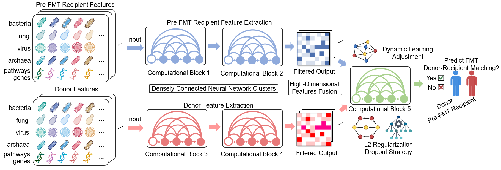
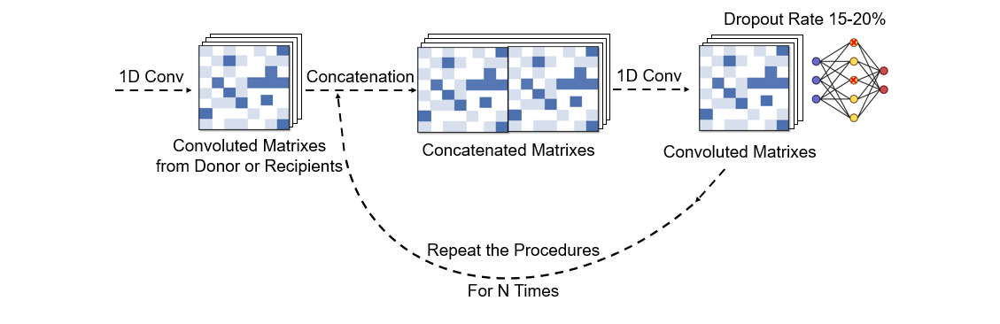

## MOZAIC (Microbiota Matching Optimization by Artificial Intelligence)

### The MOZAIC framework:

### Requirements
- python 3.9.7 or higher (recommend the version 3.9.7)
- keras==2.10.0
- pandas==1.5.2
- numpy==1.23.5
- sklearn=1.2.0
- propy3=1.1.0
- gensim=4.2.0 or 4.3.0
- scipy=1.9.3
- tensorflow=2.10.0

## General utilization guidance:

**1.** The deployment codes can be found in "MOZAIC.py", with full details and annotations attached. Firstly, open "MOZAIC.py" on your laptop (e.g., by Spyder) and introduce all of the necessary packages aforementioned (codes are available in the "MOZAIC.py" file). All of the core codes for designing MOZAIC are deposited in "utils1.py", which can be directly imported by the training codes available in "MOZAIC.py"

**2.** Prepare the necessary datasets (independent training, validation, and test datasets), which have been deposited in .npy files. In detail, files including **"donor_training.npy", "recipient_training.npy", "donor_validation.npy", "recipient_validation.npy", "donor_testing.npy", and "recipient_testing.npy"** have all been submitted to GitHub for convenience. **The name of each input feature for MOZAIC is available in "Input_Variable_Annotation.txt". The order of these feature corresponds precisely to the columns in the data matrices, arranged sequentially from left to right and top to bottom.**

**3.** Following the codes provided in "MOZAIC.py" and running it in your local Spyder or other suitable environment directly, the training of MOZAIC will be smoothly performed.

### MOZAIC framework and design
MOZAIC integrates five densely interconnected neural computational blocks, activation modules, filter layers, and multi-layer perceptrons. Its upstream computational blocks extract parallel featural characteristics from donor and recipient features, while downstream layers identify intrinsic complementary patterns within donor-recipient pairs. By prioritizing interconnective patterns between paired donor-recipient features over isolated features, MOZAIC minimizes asymmetric biases inherent in conventional machine learning approaches.

#### The core mathematical mechanisms for each computational block in MOZAIC:

#### The core mathematical mechanisms for high-dimensional features fusion in MOZAIC:

The framework incorporates L2-regularization, randomized dropout (15-20%), and dynamic learning rate adjustment to balance feature weights symmetrically across donor and recipient data while suppressing redundant representations. More mathematical details are available in "utils1.py".

### Brief Introduction of Developers
#### Developer Introduction

**Sizhe Chen**, PhD Student (Medical Sciences) at Chinese University of Hong Kong (1155202847@link.cuhk.edu.hk), and Microbiota I-center Limited (Magic).

Supervisor: **Professor CHAN Ka Leung Francis**, **Professor Siew N.G.**, and **Research Assistant Professor Qi Su**. Welcome to contact **Sizhe Chen** via the aforementioned email if you have any questions or suggestions.

This work is supervised by **Professor Siew N.G.** and **Research Assistant Professor Qi Su**. The research work is primarily finished by **Sizhe Chen** (PhD student).

